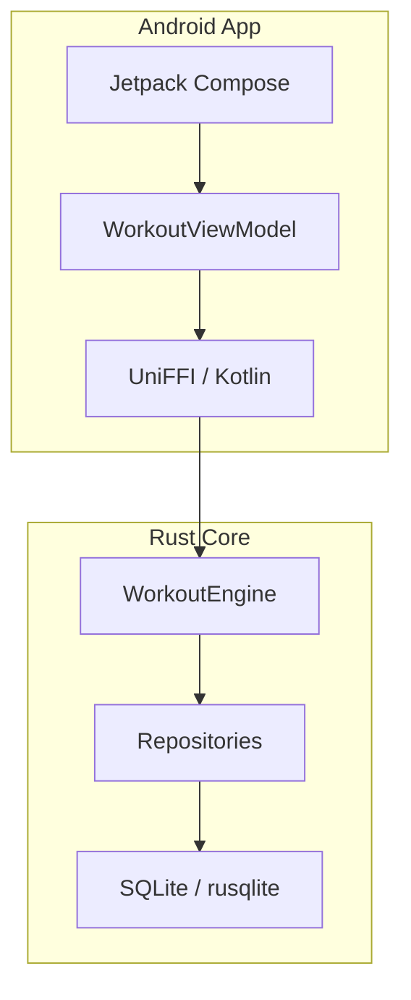

# RustyPl8s Workout Tracker - Technical Walkthrough

This document summarizes the architecture and implementation of the RustyPl8s workout tracker, featuring a Rust "Headless Core" and an Android Jetpack Compose frontend.

## Architecture Overview

The project follows a **Shared Core** architecture where all business logic, data modeling, and persistence are handled in Rust, while the Android app serves as a thin UI layer.

## 1. Rust Domain Models ([domain.rs](file:///home/pim/Repos/rustyPl8s/core/src/domain.rs))
Rigid, domain-driven models support complex workout structures:
- **ExerciseBlock**: Enum supporting `Standard`, `Superset`, and `Circuit`.
- **SetLog**: Includes `sequence_order` for precise reordering and `SetType` (Warmup, DropSet, etc.).
- **ActiveExercise**: Tracks sets, notes, and `target_rest_time` for automated timers.

## 2. Relational Persistence ([db.rs](file:///home/pim/Repos/rustyPl8s/core/src/db.rs))
Uses `rusqlite` for high-performance historical analytics.
- **Flattening**: The nested `ExerciseBlock` structure is flattened into a relational schema using `block_id` and `block_type`.
- **Atomicity**: `SessionRepository` ensures that saving a session correctly updates all related active exercises and logs.

## 3. UniFFI Bridge ([lib.rs](file:///home/pim/Repos/rustyPl8s/core/src/lib.rs))
The `WorkoutEngine` orchestrates thread-safe access to the database.
- **Serialization Strategy**: Complex payloads are passed as JSON strings to avoid FFI complexity, decoded in Kotlin via `kotlinx.serialization`.
- **Thread Safety**: Wrapped in `Arc<Mutex<Connection>>` to safely handle Android's multi-threaded environment.

## 4. Android Frontend
- **Initialization**: `MainApplication` sets up the engine with the device-specific file path.
- **Reactive UI**: `WorkoutViewModel` exposes a `StateFlow<WorkoutUiState>` observed by the `ActiveWorkoutScreen` in Compose.

## Verification Summary
- **Rust Unit Tests**: Verified database initialization, exercise repository, and session roundtrip (Save/Load).
- **Bridge Tests**: Verified `WorkoutEngine` initialization and exercise creation flow.
- **Android Configuration**: Build scripts and UI components mapped exactly to the Rust core API.
